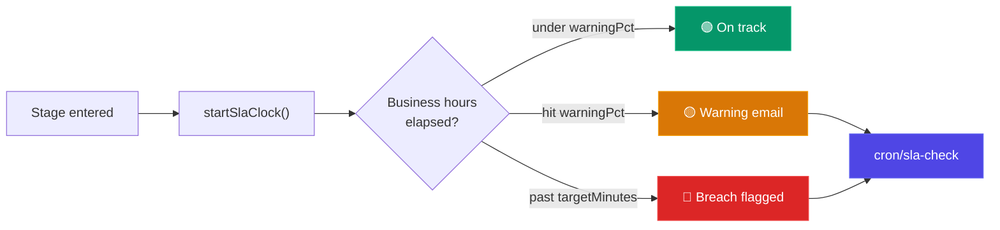
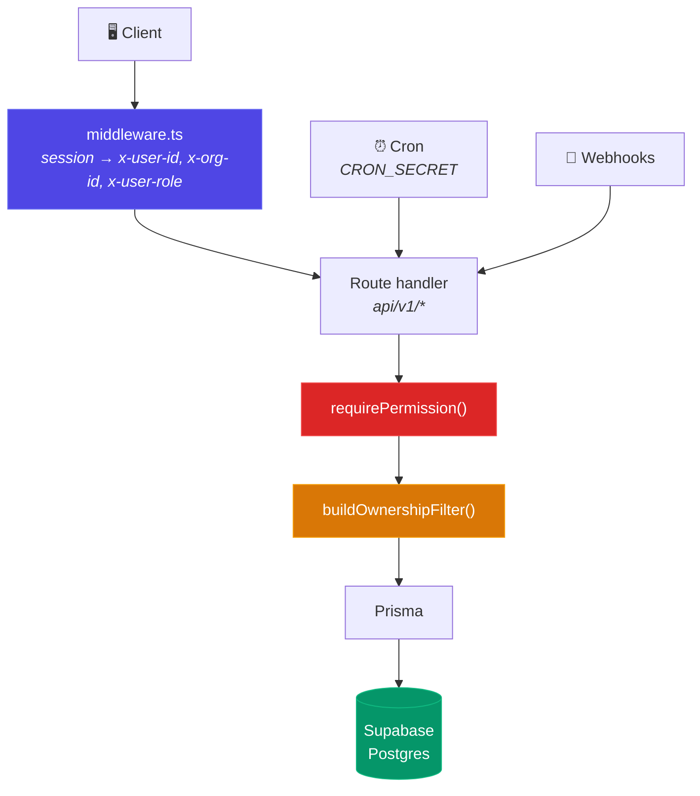

<div align="center">

# ⚙️ VECK

### Steel Trading CRM Operating System

*A technology-first operating system for steel trading businesses — it standardizes the process instead of relying on individual employees.*

<br/>


<br/>


<br/>

**[Features](FEATURES.md)** · **[Backlog](VECK_Feature_Backlog_Progress_List.md)** · **[Architecture](docs/ARCHITECTURE.md)** · **[Setup](docs/SETUP.md)** · **[API](docs/API.md)**

</div>

---

## 🔄 How a lead moves through VECK

```mermaid
flowchart LR
    subgraph SRC["📥 Sources"]
        IM["IndiaMart"]
        TI["TradeIndia"]
        EM["Email"]
        WA["WhatsApp"]
        JD["JustDial"]
    end

    SRC --> GATE{"🔐 Secret +<br/>rate limit"}
    GATE --> DEDUP{"🔍 Dedup on<br/>externalId"}
    DEDUP -->|new| CREATE["createLeadWithDefaults()"]
    DEDUP -->|duplicate| DROP["Ack and skip"]
    CREATE --> ASSIGN["⚖️ pickAssignee()"]
    ASSIGN --> SLA["⏱️ SLA clock starts"]
    SLA --> PIPE["📋 Pipeline + SOP checklist"]

    style SRC fill:#1e293b,stroke:#475569,color:#e2e8f0
    style CREATE fill:#4f46e5,stroke:#6366f1,color:#fff
    style ASSIGN fill:#7c3aed,stroke:#8b5cf6,color:#fff
    style SLA fill:#dc2626,stroke:#ef4444,color:#fff
    style PIPE fill:#059669,stroke:#10b981,color:#fff
    style DROP fill:#475569,stroke:#64748b,color:#cbd5e1
```



Every channel converges on **one** creation path — so dedup and assignment rules can't be bypassed per-channel.

---

## 🚀 Quick Start

```bash
git clone https://github.com/vansh051102/veck.git
cd veck
npm install
cp .env.example .env.local     # fill in Supabase keys + DATABASE_URL
npm run dev
```

Open **http://localhost:3000**. Full walkthrough in **[docs/SETUP.md](docs/SETUP.md)**.

<details>
<summary><b>⚠️ Two gotchas that will bite you</b></summary>

<br/>

**1. The committed env file is `_env.local`, not `.env.local`.** Next.js won't auto-load the underscore version:

```bash
cp _env.local .env.local
```

**2. Never run `next build` while the dev server is running.** The production build clobbers the dev server's `.next` cache and you'll get `Cannot find module './XXXX.js'`. Recovery:

```bash
# stop dev server first
rm -rf .next && npm run dev
```

**3. Read [docs/database-migrations.md](docs/database-migrations.md) before any migration command.** The project was baselined onto Prisma Migrate — running `migrate deploy` without `prisma migrate resolve --applied 0_init` first will fail, and `migrate dev` may offer to reset your database.

</details>

---

## ✨ What's built

<details open>
<summary><b>🔐 Auth &amp; Access Control</b></summary>

<br/>

Supabase Auth issues the session; `middleware.ts` injects `x-user-id` / `x-org-id` / `x-user-role`, and fine-grained permission checks run inside each route handler.

| Capability | Owner |
|---|---|
| Permission strings + role→permission map | `lib/permissions.ts` |
| Enforcement & ownership scoping | `lib/rbac.ts`, `lib/ownership.ts` |
| Per-org module toggles | `lib/modules.ts` |
| Audit trail | `lib/audit.ts` |

**Roles:** `admin` · `marketing_manager` · `marketing_executive` · `sales_manager` · `sales_executive` · `purchase` · `sales_purchase`

**PII protection on export** — `Role.maskPiiData` masks all but the last 4 chars of email/phone/GST; `maxExportLimitDaily` caps rows per day. Admins bypass both.

</details>

<details>
<summary><b>📥 Omnichannel Lead Ingestion</b> — 5 channels</summary>

<br/>

| Channel | Mechanism | Route |
|---|---|---|
| IndiaMart | Webhook, dedup on `UNIQUE_QUERY_ID` | `webhooks/indiamart/[secret]` |
| TradeIndia | Webhook | `webhooks/tradeindia/[secret]` |
| Email | SendGrid inbound-parse | `webhooks/email/[secret]` |
| WhatsApp | Meta Cloud API — **inbound only** | `webhooks/whatsapp` |
| JustDial | **Polling**, 20-min lookback | `cron/justdial-poll` |

> WhatsApp has no outbound send path and no conversational bot. Inbound messages create leads but aren't kept as a per-lead message log.

</details>

<details>
<summary><b>📋 Lead Management &amp; SOP enforcement</b></summary>

<br/>

Stage-gated SOP checklists per track (sales / marketing / purchase) resolve via `lib/sop-checklists.ts` and surface on the lead.

- Stages, terminal/won states, deal-lost reasons — `lib/lead-stages.ts`
- Auto-assignment (round-robin or least-open-leads) — `lib/auto-assign.ts`
- Follow-up scheduling + overdue nudges — `lib/follow-up.ts`
- Import / export — `lib/csv.ts`
- Timeline, activities, documents — `api/v1/leads/[id]/*`

</details>

<details>
<summary><b>⏱️ SLA, KRA &amp; Performance</b></summary>

<br/>

The SLA engine measures in **business time, not wall-clock** — `BusinessCalendar` defines working hours, so a lead arriving at 2am doesn't burn a rep's clock.



Config lives in `SlaRule` + `BusinessCalendar`; reports at `api/v1/reports/{sla-breaches,sla-trends,kra-performance}`.

</details>

<details>
<summary><b>🧾 Quotations</b></summary>

<br/>

- PDF generation via `pdf-lib` — `lib/quote-pdf.ts` (no headless browser needed)
- Sequential document numbering — `lib/numbering.ts`
- Send + purchase requests — `api/v1/quotes/[id]/send`, `api/v1/purchase-requests`

</details>

<details>
<summary><b>📊 Dashboards &amp; Multi-tenancy</b></summary>

<br/>

Each role lands on its own dashboard (`lib/dashboard-routes.ts`): admin · sales · purchase · marketing · sales-purchase.

Analytics (`app/(app)/analytics`) shows stage distribution across all stages, per-salesperson stats, and activity volume. *(No interactive drill-down yet.)*

Every tenant is an `Organization` — **56 of 62** API routes are `orgId`-scoped.

</details>

<details>
<summary><b>⛔ Not implemented</b> — don't mistake these for features</summary>

<br/>

| Thing | Reality |
|---|---|
| **Tally Bridge** | A 13-line *"Configuration UI placeholder"*. No sync, no XML, no API client. `TallySyncQueue` exists only in an **unapplied** migration, not in `schema.prisma` |
| **Trading ERP** | Specified in the plan, tracked as backlog Phase 8. Source in `src/` is **excluded from the build** |
| **WhatsApp outbound / chatbot** | Inbound ingestion only |
| **Email threads on a lead** | Inbound creates leads; outbound is limited to SLA notifications |

</details>

---

## 🏗️ Architecture



<details>
<summary><b>📂 Project structure</b></summary>

<br/>

```
veck/
├── app/
│   ├── (app)/             # Authenticated app (leads, dashboards, analytics)
│   ├── admin/             # Admin portal + per-org workspace
│   ├── api/v1/            # REST API (62 routes)
│   └── auth/              # Login, signup, callback
├── components/
│   ├── admin/  analytics/  auth/  dashboard/
│   └── ui/                # shadcn/ui primitives
├── lib/                   # Business logic
│   ├── rbac.ts  permissions.ts        # Access control
│   ├── lead-creation.ts  auto-assign.ts  lead-stages.ts
│   ├── sla-engine.ts  sop-checklists.ts  follow-up.ts
│   ├── quote-pdf.ts  numbering.ts
│   ├── integrations/      # JustDial poller
│   └── __tests__/         # Unit tests (Jest)
├── e2e/                   # End-to-end tests (Playwright)
├── prisma/
│   ├── schema.prisma      # Schema single source of truth
│   └── migrations/
├── scripts/
├── src/                   # Phase 2 ERP WIP — excluded from build
├── docs/
└── public/
```

</details>

<details>
<summary><b>🧰 Stack &amp; why each piece is here</b></summary>

<br/>

| Layer | Choice | Why |
|---|---|---|
| Framework | Next.js 14 (App Router) | Server components + colocated API routes |
| ORM | Prisma | `schema.prisma` is the schema single source of truth |
| DB / Auth | Supabase (Postgres) | Managed Postgres + JWT auth |
| Validation | Zod | Same schemas reused by API and forms |
| PDFs | `pdf-lib` | Quote generation without a headless browser |
| Email | Resend | SLA breach/warning notifications |
| Logging | `pino` | Structured logs |
| State / Tables | Zustand · TanStack Table | Client state, lead grids |
| UI | Tailwind + shadcn/ui | — |

</details>

---

## 🗺️ Roadmap

| Phase | Focus | Status |
|:---:|---|:---:|
| **0** | Foundation — auth, RBAC, API, schema | ✅ Complete |
| **1** | CRM & Sales — leads, pipeline, SOP, SLA | ✅ Complete |
| **2** | Trading ERP — orders, inventory, invoicing | ⏳ Planned |
| **3** | Accounts, AI, Automation & Analytics | ⏳ Planned |

Live task status → **[VECK_Feature_Backlog_Progress_List.md](VECK_Feature_Backlog_Progress_List.md)**

---

## 📚 Documentation

Each document has exactly one job — status lives in the backlog, spec lives in the plan, schema lives in Prisma.

<details>
<summary><b>Full documentation index</b></summary>

<br/>

**Product & status**
| Doc | Job |
|---|---|
| [FEATURES.md](FEATURES.md) | What's built today — and what only looks built |
| [Backlog](VECK_Feature_Backlog_Progress_List.md) | Live task status |
| [IMPLEMENTATION_PLAN.md](IMPLEMENTATION_PLAN.md) | Master technical spec |
| [ROADMAP.md](ROADMAP.md) | Phase summary |

**Engineering**
| Doc | Job |
|---|---|
| [ARCHITECTURE.md](docs/ARCHITECTURE.md) | Stack, request flow, ingestion, background jobs |
| [API.md](docs/API.md) | Endpoint contracts |
| [DATABASE.md](docs/DATABASE.md) | → [`prisma/schema.prisma`](prisma/schema.prisma) |
| [SETUP.md](docs/SETUP.md) | Local development |
| [database-migrations.md](docs/database-migrations.md) | ⚠️ Read before any migration |
| [DEPLOYMENT.md](docs/DEPLOYMENT.md) | Env vars, cron, rollback |
| [CLAUDE.md](CLAUDE.md) | Guidelines for AI-assisted changes |

**Team**
| Doc | Job |
|---|---|
| [SOP_GUIDE.md](docs/SOP_GUIDE.md) | For the sales team |

</details>

---

## 🧪 Testing

```bash
npm run lint          # ESLint
npx tsc --noEmit      # Type check
npx jest              # Unit tests (18 suites)
npm run e2e           # Playwright
```

---

<div align="center">

**Product Owner:** Vansh Gupta  ·  **License:** Proprietary — all rights reserved

<sub>Questions or issues → open a GitHub issue.</sub>

</div>
